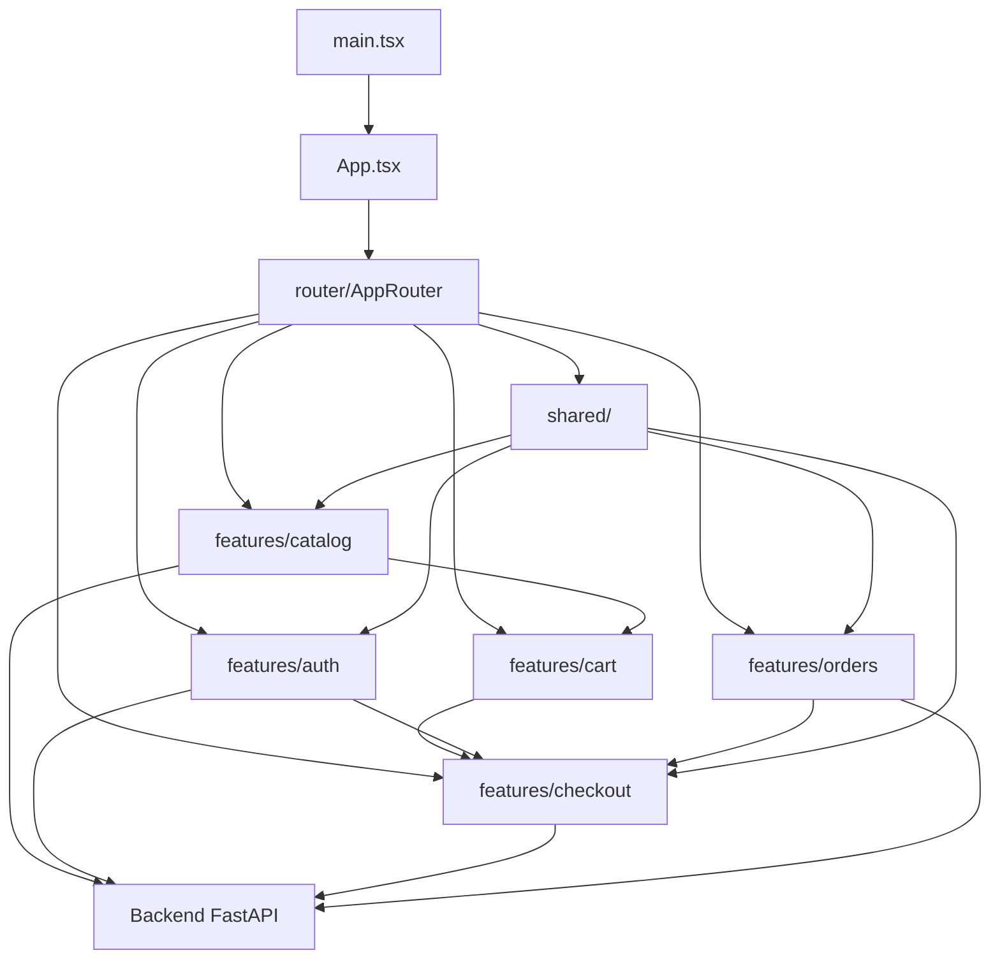
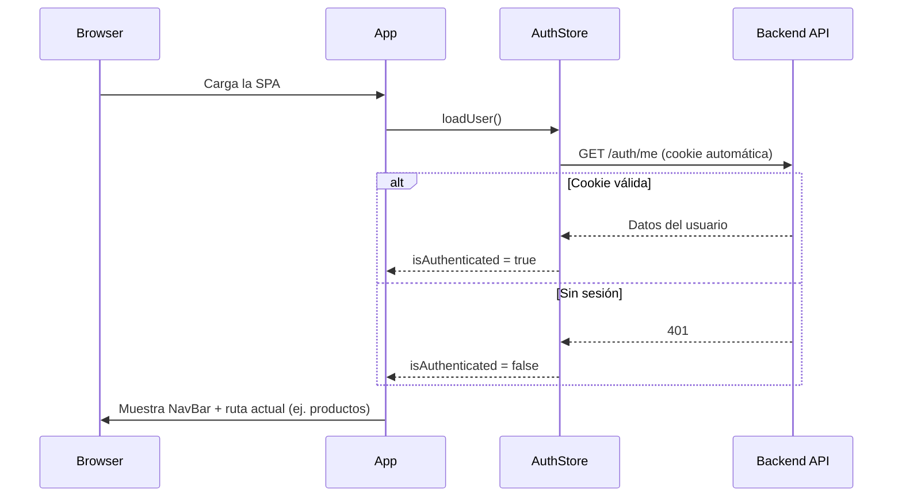
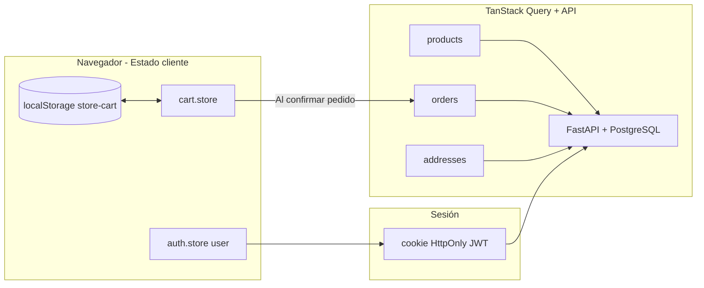

# Documentación general — Store App (Frontend Cliente)

Este documento describe **cómo funciona la tienda pública** (`store-app`): qué hace cada capa del proyecto y **cómo circulan los datos** desde que el usuario entra a la página principal hasta que confirma un pedido y lo consulta después.

No está pensado como un recorrido línea por línea del código, sino como una guía para entender el sistema completo en el contexto del parcial (React + FastAPI, estado de servidor, estado de cliente, autenticación y pedidos).

**Convención:** la **primera vez** que aparece una herramienta, hook o función relevante, se explica qué es y **dónde se usa en `store-app`**. Las definiciones centrales están en la **sección 2**; el resto del documento las reutiliza y profundiza en el flujo.

| Concepto | Definición principal |
|----------|----------------------|
| Módulos `src/` (`features/`, `shared/`, `router/`) | Sección *Estructura de módulos* (inicio) |
| Zustand, `persist`, `useCartStore`, `useAuthStore` | Sección 2 y 6 |
| TanStack Query (`QueryClient`, `useQuery`, `useMutation`, …) | Sección 2 (tabla) y 9 |
| Cookie HttpOnly, JWT, `withCredentials` | Sección 2 y 4 |
| Axios, interceptor, servicios por feature | Sección 2 y 4 |
| React Router (`Link`, `useNavigate`, `useParams`, …) | Sección 2 y 10 |
| TanStack Form, `useState`, `useEffect` | Secciones 7 y 11 |

---

## Estructura de módulos del proyecto (`src/`)

La app está organizada por **features** (dominios de negocio) más una capa **`shared/`** para lo común. Los imports usan el alias **`@/`** → `src/` (ej. `@/features/catalog`).

```txt
src/
├── main.tsx, App.tsx, index.css
├── router/
│   └── AppRouter.tsx
├── shared/
│   ├── api/client.ts              # Axios + interceptor
│   └── components/layout/NavBar.tsx
└── features/
    ├── catalog/    api, hooks, pages, types
    ├── cart/       store, pages
    ├── auth/       api, store, hooks, pages, types
    ├── checkout/   api, hooks, pages, types
    └── orders/     api, hooks, pages, types
```

Cada feature suele tener: **`api/`** (llamadas HTTP), **`hooks/`** (TanStack Query), **`pages/`** (pantallas), **`types/`** (interfaces), y **`store/`** si aplica (Zustand).

---

### `main.tsx` y `App.tsx`

| Archivo | Qué hace |
|---------|----------|
| **`main.tsx`** | `QueryClient` + `QueryClientProvider` + monta `App`. |
| **`App.tsx`** | `BrowserRouter`, renderiza `AppRouter`, `loadUser()` al iniciar (`features/auth/store`). |

---

### `shared/` — Infraestructura compartida

| Ruta | Qué hace |
|------|----------|
| **`shared/api/client.ts`** | Instancia Axios (`VITE_API_URL`, `withCredentials`, interceptor de errores). |
| **`shared/components/layout/NavBar.tsx`** | Barra superior; usa `useCartStore` y `useAuthStore`. |

---

### `router/AppRouter.tsx`

Declara rutas e importa páginas desde cada feature (`@/features/catalog`, `@/features/cart`, etc.). Incluye `NavBar` y `<main>` con `<Routes>`.

| Ruta | Página | Feature |
|------|--------|---------|
| `/` | `ProductsPage` | catalog |
| `/products/:id` | `ProductDetailPage` | catalog |
| `/cart` | `CartPage` | cart |
| `/login`, `/register` | `LoginPage`, `RegisterPage` | auth |
| `/checkout` | `CheckoutPage` | checkout |
| `/orders` | `OrdersPage` | orders |
| `/profile` | `ProfilePage` | auth |

---

### `features/catalog/` — Catálogo público

| Carpeta | Contenido |
|---------|-----------|
| `api/product.service.ts` | `getProducts`, `getProductById`, mapeo a `IProduct` |
| `hooks/useProducts.ts`, `useProductDetail.ts` | Queries del listado y detalle |
| `pages/ProductsPage.tsx`, `ProductDetailPage.tsx` | UI |
| `types/` | `product.types.ts`, `category.types.ts`, `ingredient.types.ts` |

---

### `features/cart/` — Carrito local

| Carpeta | Contenido |
|---------|-----------|
| `store/cart.store.ts` | `useCartStore`, `persist` → `localStorage` (`store-cart`) |
| `pages/CartPage.tsx` | Ver/editar carrito, ir a checkout o login |

---

### `features/auth/` — Sesión y cuenta

| Carpeta | Contenido |
|---------|-----------|
| `api/auth.service.ts` | `login`, `register`, `getMe`, `logout` |
| `store/auth.store.ts` | `useAuthStore`, `loadUser`, `loginUser`, `hasRole` |
| `hooks/useProfile.ts` | Query de perfil (`/me`) |
| `pages/LoginPage`, `RegisterPage`, `ProfilePage` | UI |
| `types/user.types.ts` | `IUser`, `UserRole` |

---

### `features/checkout/` — Finalizar compra

| Carpeta | Contenido |
|---------|-----------|
| `api/addresses.service.ts` | Direcciones del cliente |
| `hooks/useAddresses.ts`, `useCreateAddress.ts`, `useCreateOrder.ts` | Queries y mutaciones |
| `pages/CheckoutPage.tsx` | Dirección, pago, confirmar pedido |
| `types/address.types.ts` | `IAddress`, `AddressPayload` |

`useCreateOrder` llama a `createOrder` definido en **`features/orders/api/orders.service.ts`**.

---

### `features/orders/` — Pedidos del cliente

| Carpeta | Contenido |
|---------|-----------|
| `api/orders.service.ts` | `createOrder`, `getOrders`, `cancelOrder` |
| `hooks/useOrders.ts`, `useCancelOrder.ts` | Listado y cancelación |
| `pages/OrdersPage.tsx` | Historial y estados |
| `types/order.types.ts` | `IOrder`, `OrderStatus`, `PaymentMethod` |

---

### Cómo se relacionan los módulos (vista rápida)



| Si necesitás… | Mirá en… |
|---------------|----------|
| Cambiar una pantalla | `features/<dominio>/pages/` |
| Agregar ruta | `router/AppRouter.tsx` |
| Nueva API | `features/<dominio>/api/` |
| Query / mutación | `features/<dominio>/hooks/` |
| Estado Zustand | `features/cart/store` o `features/auth/store` |
| Tipos | `features/<dominio>/types/` |
| NavBar | `shared/components/layout/NavBar.tsx` |
| Axios global | `shared/api/client.ts` |

---

## 1. Rol de la aplicación en el proyecto

`store-app` es el **frontend orientado al cliente final** de un sistema de comida (foodstore). Vive en un repositorio **separado** del panel de administración (`admin-app`), pero **ambos consumen el mismo backend** FastAPI.

| Responsabilidad | Dónde se resuelve |
|-----------------|-------------------|
| Ver catálogo de productos | Backend → `ProductsPage` / `ProductDetailPage` |
| Armar carrito (sin login) | `features/cart/store/cart.store` |
| Identificar al cliente | Backend (JWT en cookie HttpOnly) → `features/auth/store` |
| Crear pedido real | `features/checkout` + `features/orders/api` |
| Ver y cancelar pedidos propios | Backend → `OrdersPage` |

La tienda es **pública para navegar y usar el carrito**. El login solo se exige cuando el flujo necesita un **usuario autenticado** (checkout, pedidos, direcciones).

---

## 2. Arquitectura en capas

La app se organiza en capas con responsabilidades claras:

```txt
┌─────────────────────────────────────────────────────────────┐
│  UI (pages + components)                                     │
│  Renderiza, captura eventos del usuario, muestra estados      │
└───────────────────────────┬─────────────────────────────────┘
                            │
        ┌───────────────────┼───────────────────┐
        ▼                   ▼                   ▼
┌───────────────┐   ┌───────────────┐   ┌───────────────┐
│ Zustand       │   │ TanStack      │   │ React Router  │
│ (cliente)     │   │ Query         │   │ (navegación)  │
│ carrito, auth │   │ (servidor)    │   │               │
└───────┬───────┘   └───────┬───────┘   └───────────────┘
        │                   │
        └─────────┬─────────┘
                  ▼
        ┌───────────────────┐
        │ features/*/api     │  →  shared/api/client.ts
        └─────────┬─────────┘
                  ▼
        ┌───────────────────┐
        │ Backend FastAPI    │
        └───────────────────┘
```

### Tipos de estado

| Tipo | Herramienta | Qué guarda | Ejemplo |
|------|-------------|------------|---------|
| **Estado del servidor** | TanStack Query | Datos que vienen de la API (productos, pedidos, direcciones) | Listado de productos en caché |
| **Estado del cliente** | Zustand | Datos que solo importan en el navegador | Ítems del carrito |
| **Persistencia local** | Zustand `persist` + `localStorage` | Carrito entre recargas | Clave `store-cart` |
| **Sesión** | Cookie HttpOnly (backend) + Zustand (memoria) | Usuario logueado | No se guarda el JWT en `localStorage` |

> **JWT** (*JSON Web Token*): cadena que el backend genera al autenticar al usuario y que identifica la sesión. En este proyecto viaja dentro de la cookie HttpOnly, no como texto visible en React.

### ¿Qué es Axios?

**Axios** es un cliente HTTP para JavaScript: simplifica hacer `GET`, `POST`, `PATCH`, etc. contra una API REST.

**En `store-app`:** toda comunicación con FastAPI pasa por **`shared/api/client.ts`**. Cada feature tiene su `api/*.service.ts` que importa ese client (`getProducts`, `login`, `createOrder`, etc.). Las pantallas usan **hooks** o stores, no Axios directo.

### ¿Qué es React Router?

**React Router DOM** gestiona la **navegación por URL** en una SPA: qué pantalla renderizar según la ruta (`/`, `/cart`, `/products/5`).

**Piezas usadas en el proyecto:**

| Pieza | Qué hace | Dónde |
|-------|----------|--------|
| `BrowserRouter` | Sincroniza la app con la barra de direcciones del navegador | `App.tsx` |
| `Routes` / `Route` | Declaran qué componente corresponde a cada path | `AppRouter.tsx` |
| `Link` | Enlace interno sin recargar toda la página | `NavBar`, `CartPage`, formularios |
| `useNavigate` | Redirección programática (ej. tras login o crear pedido) | `LoginPage`, `CartPage`, `CheckoutPage`, `ProductDetailPage` |
| `useParams` | Lee parámetros de la URL (ej. `id` en `/products/:id`) | `ProductDetailPage` |

### ¿Qué es Zustand?

**Zustand** (alemán: “estado”) es una librería de **gestión de estado global** para React. Permite crear un “store” al que cualquier componente puede suscribirse sin pasar props por muchos niveles ni montar un árbol enorme de Context.

**Para qué se usa en general:**

- Guardar datos que **varios componentes** necesitan a la vez (carrito, usuario logueado, tema, etc.).
- Exponer **acciones** que modifican ese estado (`addProduct`, `loginUser`, etc.).
- Opcionalmente **persistir** parte del estado en `localStorage` con el middleware **`persist`** (guarda y restaura el store automáticamente).

Los hooks generados (`useCartStore`, `useAuthStore`) permiten leer solo lo necesario, por ejemplo `useCartStore((s) => s.getTotalItems)`, para no re-renderizar todo el componente ante cualquier cambio del store.

**En `store-app` se usa para el estado del cliente** (lo que no viene directamente del servidor en cada momento):

| Store | Archivo | Uso principal |
|-------|---------|---------------|
| Carrito | `features/cart/store/cart.store.ts` | Ítems, cantidades, totales; persistido en `localStorage` |
| Autenticación (memoria) | `features/auth/store/auth.store.ts` | Usuario actual, `isAuthenticated`, helpers de rol |

**Módulos / pantallas que consumen Zustand:**

| Store | Dónde se usa |
|-------|----------------|
| `useCartStore` | `ProductsPage`, `ProductDetailPage`, `CartPage`, `CheckoutPage`, `NavBar` |
| `useAuthStore` | `App.tsx`, `CartPage`, `CheckoutPage`, `LoginPage`, `RegisterPage`, `NavBar` |

TanStack Query y Zustand **no compiten**: Query maneja datos del API; Zustand maneja carrito y la “vista” del usuario logueado en memoria.

### ¿Qué es TanStack Query?

**TanStack Query** (antes *React Query*) es una librería para el **estado del servidor**: datos que viven en el backend y se obtienen por HTTP.

**Para qué se usa:**

- Hacer **peticiones GET/POST/PATCH** y guardar el resultado en una **caché** inteligente.
- Mostrar estados **`isLoading`**, **`isError`** y datos listos sin escribir mucho boilerplate.
- **Evitar pedidos duplicados** si dos componentes piden lo mismo.
- Tras una **mutación** (crear, editar, borrar), **invalidar** la caché para refrescar listados.

**En `store-app`:**

| Configuración | Archivo |
|---------------|---------|
| `QueryClient` + `QueryClientProvider` | `main.tsx` |
| `useQuery` (lecturas) | Hooks en `catalog`, `checkout`, `orders`, `auth` (vía `useProducts`, `useAddresses`, `useOrders`, `useProfile`) |
| `useMutation` (escrituras) | `CheckoutPage`, `OrdersPage` |
| `invalidateQueries` | `CheckoutPage` (direcciones), `OrdersPage` (pedidos) |

Los **hooks** en cada feature llaman a los servicios de `features/*/api/`; Query no reemplaza Axios, **orquesta** cuándo y cómo se llama.

#### Piezas principales de TanStack Query (qué hace cada una)

| Pieza | Qué es / qué hace | En este proyecto |
|-------|-------------------|------------------|
| **`QueryClient`** | Objeto central que guarda la **caché** de todas las consultas y las reglas por defecto (reintentos, tiempo de frescura, etc.). | Se crea **una vez** en `main.tsx`. |
| **`QueryClientProvider`** | Componente de React que **inyecta** ese `QueryClient` en el árbol para que los hooks funcionen en cualquier hijo. | Envuelve `<App />` en `main.tsx`. Sin él, `useQuery` y `useMutation` fallan. |
| **`useQuery`** | Hook para **leer** datos del servidor: dispara una función async, expone `data`, `isLoading`, `isError` y guarda el resultado en caché bajo una `queryKey`. | `useProducts`, `useProductDetail`, `useAddresses`, `useOrders`, `useProfile` (en `features/*/hooks/`). |
| **`useMutation`** | Hook para **escribir** en el servidor (crear, actualizar, borrar): ejecuta una función al llamar `mutate()` y permite `onSuccess` / `onError`. | Crear dirección y pedido (`CheckoutPage`); cancelar pedido (`OrdersPage`). |
| **`queryKey`** | Identificador en forma de array (ej. `["products"]`, `["product-detail", id]`) que etiqueta una entrada de caché. Misma clave = mismos datos compartidos o invalidados. | Todas las `useQuery` del proyecto. |
| **`queryFn`** | Función async que **obtiene** los datos (normalmente llama a un `*.service.ts`). | Ej. `queryFn: getProducts`, `queryFn: () => getProductById(id)`. |
| **`staleTime`** | Tiempo durante el cual los datos se consideran “frescos” y Query **no** vuelve a pedirlos al remontar el componente. | `ProductsPage` y `ProductDetailPage`: 5 minutos. |
| **`invalidateQueries`** | Marca una o más `queryKey` como obsoletas para **refetch** automático cuando haga falta. | Tras crear dirección (`["addresses"]`) o cancelar pedido (`["orders"]`). |

### ¿Qué es una cookie HttpOnly?

Una **cookie** es un dato pequeño que el **servidor** pide al navegador guardar y **reenviar** en peticiones siguientes al mismo dominio (o configuración CORS permitida).

La bandera **`HttpOnly`** significa que **JavaScript del frontend no puede leer ni modificar** esa cookie (`document.cookie` no la expone). Solo el navegador la adjunta automáticamente en las peticiones HTTP.

**Para qué se usa en este proyecto:**

- El backend, tras un login correcto (`POST /api/v1/auth/token`), responde con **`Set-Cookie`** incluyendo el **JWT** (token de sesión).
- El token **no** se guarda en `localStorage` ni en variables accesibles desde React, lo que reduce el riesgo si hubiera un ataque XSS.
- En cada request autenticado, Axios envía la cookie gracias a **`withCredentials: true`** en `shared/api/client.ts`.
- El frontend solo guarda en Zustand el **objeto usuario** devuelto por `GET /api/v1/auth/me`, no el token en sí.

**Flujo resumido:**

1. Usuario hace login → backend valida credenciales → setea cookie HttpOnly con JWT.
2. `getMe()` y el resto de endpoints protegidos → el navegador manda la cookie sola.
3. Logout → backend borra o invalida la cookie → `auth.store` limpia el usuario en memoria.

**Módulos involucrados:** `shared/api/client.ts`, `features/auth/api/auth.service.ts`, `features/auth/store/auth.store.ts`, `App.tsx` (`loadUser`), y pantallas que requieren sesión (`CheckoutPage`, `OrdersPage`, etc.).

---

## 3. Arranque de la aplicación

### `main.tsx`

Al iniciar la app:

1. Se crea un **`QueryClient`** — ver tabla en sección 2 (*Piezas principales de TanStack Query*): es la “memoria” de las peticiones al servidor.
2. Se envuelve toda la aplicación en **`QueryClientProvider`** — provee ese client al árbol; habilita **`useQuery`** (lecturas) y **`useMutation`** (escrituras) en cualquier pantalla.
3. Se monta el componente raíz **`App`**.

### `App.tsx`

1. Envuelve la app en **`BrowserRouter`** — habilita rutas según la URL (ver *¿Qué es React Router?* en sección 2).
2. En un **`useEffect`** — hook de React que ejecuta código **después del primer render** — llama a **`loadUser()`** del `auth.store`.
3. **`loadUser`**: acción de Zustand que llama `getMe()` (`GET /api/v1/auth/me`). Si hay **cookie HttpOnly válida**, guarda el usuario y `isAuthenticated = true`; si no (401), la app queda como **visitante anónimo** (puede ver productos y usar carrito igual).

### `AppRouter.tsx` + `NavBar`

- **`AppRouter`**: agrupa `<Routes>` y cada `<Route path="..." element={...} />` — mapa URL → pantalla (`ProductsPage`, `CartPage`, etc.).
- **`NavBar`**: componente fijo con **`Link`** a rutas, contador de ítems vía **`useCartStore`**, y bloque de usuario vía **`useAuthStore`** (nombre, logout o enlace a login).

**Flujo al abrir el sitio:**



---

## 4. Capa de comunicación HTTP

### `shared/api/client.ts` — Instancia Axios

Centraliza **todas** las peticiones (ver *¿Qué es Axios?* en sección 2):

- **`baseURL`**: prefijo común de todas las URLs; sale de **`VITE_API_URL`** en `.env` (ej. `http://localhost:8000`). Los servicios solo agregan rutas (`/productos/`, `/api/v1/pedidos/`).
- **`withCredentials: true`**: indica al navegador que **incluya cookies** en peticiones cross-origin. Obligatorio para que la cookie HttpOnly del JWT llegue al backend cuando Vite (`:5173`) y FastAPI (`:8000`) son orígenes distintos.
- **Interceptor de respuesta**: función que Axios ejecuta en **cada respuesta** (éxito o error). Aquí, si hay error HTTP, lee `error.response.data.detail` (formato típico de FastAPI) y devuelve un `Promise.reject(new Error(mensaje))` para que login, checkout u otras pantallas muestren el texto al usuario.

### Autenticación: cookie HttpOnly en la práctica

| Momento | Qué pasa |
|---------|----------|
| Login exitoso | Backend responde con `Set-Cookie`; el navegador almacena el JWT con `HttpOnly` |
| Peticiones siguientes | Axios + `withCredentials` → cookie adjunta automáticamente; React **no** lee el token |
| `getMe()` / pedidos / direcciones | El backend identifica al usuario desde la cookie |
| Logout | `POST /logout` → backend elimina o invalida la cookie; Zustand pone `user = null` |

El frontend **nunca** guarda el JWT en `localStorage` ni lo pasa en headers `Authorization` manualmente en este proyecto: el contrato es **cookie-only**, alineado con las consignas del parcial.

### Servicios por feature (`features/*/api/`)

Cada dominio tiene su servicio que importa `shared/api/client.ts`:

| Archivo | Feature | Responsabilidad |
|---------|---------|-----------------|
| `product.service.ts` | catalog | `getProducts`, `getProductById`, mapeo a `IProduct` |
| `auth.service.ts` | auth | Login, registro, `getMe`, logout |
| `addresses.service.ts` | checkout | Direcciones de entrega |
| `orders.service.ts` | orders | Crear, listar y cancelar pedidos |

El **mapeo** en `catalog/api/product.service.ts` transforma el JSON del backend (`nombre`, `precio_base`, etc.) al tipo `IProduct` del frontend.

---

## 5. Modelos de datos (`features/*/types/`)

Las **interfaces TypeScript** viven dentro de cada feature:

| Tipo | Ubicación |
|------|-----------|
| `IProduct`, categoría, ingrediente | `features/catalog/types/` |
| `IUser`, `UserRole` | `features/auth/types/user.types.ts` |
| `IAddress` | `features/checkout/types/address.types.ts` |
| `IOrder`, `IOrderDetail`, `PaymentMethod` | `features/orders/types/order.types.ts` |

Estas interfaces documentan las **relaciones** que el parcial pide mostrar en UI (producto ↔ categoría ↔ ingredientes).

---

## 6. Estado global del cliente (Zustand)

En esta sección se detalla **cómo** usamos Zustand en los dos stores del proyecto. Si necesitás la definición general de la librería, está en la sección 2 (*¿Qué es Zustand?*).

**Resumen:** Zustand centraliza estado que debe ser **global en el navegador** pero **no necesariamente en el servidor** (carrito) o que es **complemento** de la sesión HTTP (datos del usuario en memoria mientras navega).

### `features/cart/store/cart.store.ts` — Carrito

El hook **`useCartStore`** es cómo los componentes **leen y modifican** el carrito: al suscribirse, se re-renderizan cuando cambian `items` o los totales.

**Qué guarda:** lista de ítems `{ product: IProduct, quantity }`.

**Acciones principales** (funciones del store):

| Acción | Efecto |
|--------|--------|
| `addProduct` | Suma 1 si ya existe el producto; si no, agrega línea nueva. |
| `increaseQuantity` / `decreaseQuantity` | Modifica cantidades; si llega a 0, quita el ítem. |
| `removeProduct` | Elimina un producto del carrito. |
| `clearCart` | Vacía todo (se usa tras confirmar pedido). |
| `getTotalItems` / `getTotalPrice` | Cálculos para NavBar y resúmenes. |

**Persistencia:** el middleware **`persist`** de Zustand guarda automáticamente el estado del store en **`localStorage`** del navegador (clave `"store-cart"`) y lo **rehidrata** al cargar la app. **`localStorage`** es almacenamiento clave-valor que sobrevive recargas y cierre del tab; aquí solo guarda el carrito, no el JWT. Si el usuario recarga la página, el carrito **sigue disponible** sin llamar al backend.

> El carrito **no** es estado de servidor: el backend no sabe qué hay en el carrito hasta que el usuario confirma el pedido.

### `features/auth/store/auth.store.ts` — Sesión en memoria

El hook **`useAuthStore`** expone el usuario logueado y las acciones de sesión a `App`, `NavBar`, `CartPage`, `CheckoutPage`, `LoginPage` y `RegisterPage`.

**Qué guarda:** `user` (objeto `IUser`), `isAuthenticated`, `isLoading`.

Este store **no guarda el JWT**. Solo guarda los datos de perfil que el backend devuelve en `/me` para mostrar nombre en el `NavBar`, validar rol `CLIENT` en login, etc. La **prueba de sesión** para el servidor es siempre la **cookie HttpOnly**.

| Acción | Flujo |
|--------|--------|
| `loadUser` | Llama `getMe()`; si la cookie es válida, llena `user`; si falla, usuario anónimo. |
| `loginUser` | `POST /token` → backend setea cookie → `getMe()` → guarda `user` en Zustand. |
| `logoutUser` | `POST /logout` → backend limpia cookie → resetea `user` e `isAuthenticated`. |
| `hasRole` | Comprueba si el usuario tiene alguno de los roles indicados (ej. solo `CLIENT` en login de tienda). |

**Pantallas que dependen de `useAuthStore`:** `App.tsx` (arranque), `CartPage` (redirigir a login), `CheckoutPage` (bloquear si no hay sesión), `LoginPage`, `RegisterPage`, `NavBar` (nombre y logout).

---

## 7. Flujo completo del usuario (de punta a punta)

Este es el recorrido principal que une todas las piezas.

```mermaid
flowchart TD
    A[Entra a / - ProductsPage] --> B{¿Agrega al carrito?}
    B -->|Sí| C[cart.store - localStorage]
    C --> D[/cart - CartPage]
    D --> E{¿Autenticado?}
    E -->|No| F[/login o /register]
    F --> G[auth: cookie + user en store]
    G --> H[/checkout - CheckoutPage]
    E -->|Sí| H
    H --> I[Selecciona dirección y pago]
    I --> J[POST /pedidos/]
    J --> K[clearCart + /orders]
    K --> L[OrdersPage - historial]
```

### Paso 1 — Explorar productos (`/` → `ProductsPage`)

1. Al montar la página, **`useQuery`** (hook de lectura; ver sección 2 y 9) ejecuta `queryFn: getProducts` con `queryKey: ["products"]`.
2. TanStack Query guarda la respuesta en caché; con **`staleTime`** de 5 minutos no vuelve a pedir el catálogo al navegar y volver si los datos siguen “frescos”.
3. El usuario puede **buscar** y **filtrar por categoría** en el cliente con estado local de React (inputs controlados), sobre el array **ya cargado** — no son peticiones nuevas al servidor.
4. Cada tarjeta muestra imagen, nombre, precio, categorías (badges con color) y disponibilidad.
5. **"Agregar"** llama `addProduct(product)` → solo actualiza **Zustand + localStorage**, sin API.

**Origen de los datos:** Backend `GET /productos/` → `product.service` mapea → caché de React Query → UI.

### Paso 2 — Detalle de producto (`/products/:id` → `ProductDetailPage`)

1. **`useParams`** (React Router): hook que devuelve los parámetros de la ruta actual; aquí lee `id` de `/products/:id`.
2. **`useQuery`** con `queryKey: ["product-detail", id]` y `queryFn: () => getProductById(id)`; suele usarse **`enabled: !!id`** para no disparar la petición si el id aún no está.
3. Se muestran descripción, stock, categorías (con marca de principal), ingredientes (alérgenos resaltados).
4. **"Agregar al carrito"** vuelve a usar solo el store del carrito.

**Origen de los datos:** Backend `GET /productos/{id}` → mapeo → UI.

### Paso 3 — Carrito (`/cart` → `CartPage`)

1. Lee **`items`** directamente de `useCartStore` (datos locales).
2. Permite subir/bajar cantidad, eliminar ítems, vaciar carrito y ver el **total**.
3. **"Continuar compra"** usa **`useNavigate`** para ir a `/login` o `/checkout` según `isAuthenticated` del `auth.store`.

**Origen de los datos:** Solo `localStorage` / memoria Zustand hasta este punto.

### Paso 4 — Autenticación (`/login`, `/register`)

Necesaria porque el pedido debe asociarse a un **usuario CLIENT** y a una **dirección** en el backend.

**Login (`LoginPage`):**

1. Formulario con **TanStack Form** — librería de formularios con validación por campo (`validators` en cada `form.Field`); usada en login, registro y alta de dirección en checkout.
2. **`loginUser(email, password)`** (Zustand) → **`auth.service.login`**:
   - **`POST /api/v1/auth/token`** con **`FormData`** (formato que espera OAuth2/password del backend: campos `username` y `password`) → backend responde con **Set-Cookie**.
   - **`getMe()`** → `GET /api/v1/auth/me` → devuelve `IUser` para el store.
3. **`hasRole(["CLIENT"])`** — comprueba que la cuenta sea cliente de tienda, no admin/empleado.
4. **`navigate("/checkout")`** — redirección tras login exitoso.

**Registro (`RegisterPage`):**

1. `POST /api/v1/auth/register` crea usuario con rol cliente.
2. Login automático con las mismas credenciales.
3. Redirige a **`/checkout`**.

**Origen de los datos:** Backend auth; el frontend solo guarda el objeto `IUser` en Zustand. La credencial sensible (JWT) queda en la **cookie HttpOnly** manejada por el navegador, no accesible desde el código React.

### Paso 5 — Checkout (`/checkout` → `CheckoutPage`)

Aquí se mezclan **estado local**, **estado de servidor** y **mutaciones**.

| Bloque | Tecnología | Datos |
|--------|------------|--------|
| Resumen del carrito | Zustand | Ítems y total |
| Direcciones guardadas | `useQuery` `["addresses"]` | `GET /api/v1/direcciones/` |
| Nueva dirección | `useMutation` + TanStack Form | `POST /api/v1/direcciones/` → `invalidateQueries(["addresses"])` |
| Forma de pago | **`useState`** (hook de React para estado de un solo componente) | EFECTIVO / MERCADOPAGO (sin pasarela real) |
| Confirmar pedido | **`useMutation`** con `mutationFn: createOrder` | `POST /api/v1/pedidos/` |

**Al confirmar el pedido**, el payload incluye:

- `direccion_entrega_id`
- `forma_pago`
- `detalles`: array `{ producto_id, cantidad }` armado desde el carrito

**Si tiene éxito:**

1. **`clearCart()`** — acción del `cart.store`; vacía ítems en memoria y en `localStorage`.
2. **`navigate("/orders")`** — lleva al historial de pedidos.

**Origen de los datos del pedido:** El backend valida stock, precios (snapshot), usuario y persiste `Pedido` + `DetallePedido`. El frontend solo envía IDs y cantidades.

### Paso 6 — Mis pedidos (`/orders` → `OrdersPage`)

1. **`useQuery`** `["orders"]` → `GET /api/v1/pedidos/` (el backend filtra solo pedidos del cliente logueado).
2. Muestra estado (`PENDIENTE`, `CONFIRMADO`, etc.), forma de pago, total y **detalles** con nombre y precio unitario (datos ya guardados en el pedido — patrón snapshot del backend).
3. **Cancelar:** `useMutation` → `PATCH .../cancelar` → en éxito **`invalidateQueries(["orders"]`)** para refrescar la lista.

### Paso 7 — Perfil (`/profile` → `ProfilePage`)

- Hook **`useProfile`** (`features/auth/hooks`) con clave `["me"]` y `getMe`.
- Muestra nombre, email, roles y estado de la cuenta.
- Complementa la info que ya puede estar en `auth.store` tras el login.

---

## 8. Qué hace cada pantalla (resumen)

| Ruta | Componente | Fuente de datos | Rol en el flujo |
|------|------------|-----------------|-----------------|
| `/` | `ProductsPage` | React Query → API productos | Entrada al catálogo |
| `/products/:id` | `ProductDetailPage` | React Query → API por ID | Detalle y relaciones |
| `/cart` | `CartPage` | Zustand (carrito) | Revisión antes de comprar |
| `/login` | `LoginPage` | Auth store + API | Sesión para checkout |
| `/register` | `RegisterPage` | API registro + login | Alta de cliente |
| `/checkout` | `CheckoutPage` | Carrito + Query/Mutation direcciones y pedido | Cierre de venta |
| `/orders` | `OrdersPage` | React Query → API pedidos | Post-venta |
| `/profile` | `ProfilePage` | `useProfile` → `/me` | Datos del cliente |

---

## 9. TanStack Query en este proyecto

Esta sección profundiza el uso en pantallas. Definiciones de **`QueryClient`**, **`QueryClientProvider`**, **`useQuery`**, **`useMutation`**, **`queryKey`**, **`queryFn`**, **`staleTime`** e **`invalidateQueries`**: sección 2, tabla *Piezas principales de TanStack Query*.

**Regla práctica en `store-app`:**

- Si los datos **vienen del API** y pueden cachearse o refrescarse → **TanStack Query** (`useQuery` / `useMutation`).
- Si los datos **solo existen en el navegador** o son la sesión en memoria → **Zustand** (carrito, `user`).

### `useQuery` — Lecturas

**`useQuery`** es el hook que **pide y cachea** datos de lectura. Recibe al menos `queryKey` y `queryFn`; devuelve `data`, `isLoading`, `isError`, `refetch`, etc. La pantalla renderiza según esos estados sin manejar manualmente `useState` + `useEffect` para cada fetch.

| Pantalla | queryKey | Para qué |
|----------|----------|----------|
| `ProductsPage` | `["products"]` | Catálogo completo |
| `ProductDetailPage` | `["product-detail", id]` | Un producto |
| `CheckoutPage` | `["addresses"]` | Direcciones del usuario (solo si `enabled: isAuthenticated`) |
| `OrdersPage` | `["orders"]` | Historial de pedidos |
| `ProfilePage` (`useProfile`) | `["me"]` | Perfil |

**`enabled`**: opción de `useQuery` que **activa o desactiva** la petición (ej. direcciones solo cuando hay sesión; detalle de producto solo cuando existe `id`). Evita llamadas al API con datos incompletos.

Beneficios: estados **`isLoading`** / **`isError`** sin boilerplate, reutilización de caché, menos peticiones repetidas.

### `useMutation` — Escrituras

**`useMutation`** es el hook para **operaciones que cambian datos** en el servidor. No se ejecuta solo al montar: se dispara con **`mutate(payload)`** o **`mutateAsync`**. Opciones típicas en el proyecto:

- **`mutationFn`**: función del servicio (`createOrder`, `createAddress`, `cancelOrder`).
- **`onSuccess`**: lógica posterior (invalidar caché, redirigir, vaciar carrito).
- **`onError`**: mostrar mensaje al usuario.
- **`isPending`**: deshabilitar botones mientras corre la petición (“Confirmando…”, “Cancelando…”).

| Pantalla | Acción | Invalidación de caché |
|----------|--------|------------------------|
| `CheckoutPage` | Crear dirección | `["addresses"]` |
| `CheckoutPage` | Crear pedido | (redirección; carrito local se limpia) |
| `OrdersPage` | Cancelar pedido | `["orders"]` |

**`invalidateQueries`** (método del `queryClient`): marca entradas de caché como obsoletas. La próxima vez que un componente necesite esa `queryKey`, TanStack Query vuelve a ejecutar el `queryFn` (por ejemplo `getOrders`) y la UI se actualiza **sin recargar la página**.

Ejemplo del flujo: el usuario cancela un pedido → `useMutation` tiene éxito → `invalidateQueries({ queryKey: ["orders"] })` → `OrdersPage` muestra la lista ya sin ese pedido o con estado `CANCELADO`.

---

## 10. Navegación (React Router)

Visión general de React Router en sección 2 (*¿Qué es React Router?*). En este proyecto:

- **`router/AppRouter.tsx`**: lista de **`<Route path="..." element={<Página />} />`** dentro de **`<Routes>`** — importa páginas desde `@/features/*`.
- **Ruta dinámica `/products/:id`**: el segmento `:id` es variable; **`useParams()`** en `ProductDetailPage` obtiene ese valor y alimenta la **`queryKey`** de TanStack Query.
- **`Link`**: navegación declarativa en JSX (NavBar, “Ver productos”, “Ir al login”) sin recargar la SPA completa.
- **`useNavigate()`**: función `navigate("/ruta")` para redirecciones tras acciones (login, checkout, volver atrás en detalle).

La **URL** decide qué pantalla se muestra; el **carrito** (Zustand/localStorage) y la **sesión** (cookie + `auth.store`) no dependen de la ruta y persisten o se consultan según el flujo.

---

## 11. Validaciones y errores

| Capa | Qué valida | Dónde |
|------|------------|--------|
| **TanStack Form** | Campos obligatorios, reglas por campo (`validators`), estado `canSubmit` / errores en `field.state.meta.errors` | `LoginPage`, `RegisterPage`, formulario de dirección en `CheckoutPage` |
| **UI (lógica de pantalla)** | Carrito no vacío, dirección elegida, usuario logueado antes de confirmar | `CheckoutPage`, `CartPage` |
| **Backend (Pydantic / servicios)** | Stock, transiciones de pedido, formato; respuesta HTTP con `detail` | FastAPI (fuera del repo frontend) |
| **Interceptor Axios** | Traduce error HTTP a `Error` con mensaje legible para `catch` o `onError` | `shared/api/client.ts`; lo consumen login, registro, mutaciones |

**TanStack Form** (primera mención ampliada): alternativa a formularios controlados a mano; define `defaultValues`, campos con `form.Field name="..."` y envío con `form.handleSubmit()`. En el proyecto valida **antes** de llamar al API, para mejor UX.

En la demo del parcial conviene mostrar un intento fallido (ej. campo vacío o error del API) para evidenciar que **frontend y backend** validan.

---

## 12. Relaciones de datos visibles en la UI

El parcial pide mostrar **datos relacionados** sin hardcodear:

- En **listado y detalle**: cada producto trae `categories[]` e `ingredients[]` del backend.
- En **detalle**: se distingue categoría principal, ingredientes alérgenos y removibles.
- En **pedidos**: cada línea muestra `producto_nombre` y `precio_unitario` guardados al crear el pedido (no se vuelve a pedir el catálogo para ese dato).

Eso refleja en frontend las relaciones **Producto–Categoría–Ingrediente** (catálogo) y **Pedido–DetallePedido** (venta).

---

## 13. Diagrama de datos: dos mundos (cliente vs servidor)



---

## 14. Requisitos del parcial cubiertos en esta app

| Requisito | Implementación en store-app |
|-----------|----------------------------|
| Home / listado de productos | `ProductsPage` |
| Detalle con relaciones | `ProductDetailPage` |
| Carrito + persist localStorage | `cart.store` con `persist` |
| Realizar pedido sin pasarela | `CheckoutPage` + `createOrder` |
| Pantalla de pedidos | `OrdersPage` |
| Instancia Axios + interceptor | `shared/api/client.ts` |
| React Router + parámetro dinámico | `AppRouter`, `/products/:id` |
| useQuery / useMutation | Varias pages |
| invalidateQueries | `CheckoutPage`, `OrdersPage` |
| Estructura por features | `features/`, `shared/`, `router/` |
| Tailwind CSS | Clases en `features/*/pages`, `shared/components/layout/NavBar` |
| Consumo de API real | Sin mock; variable **`VITE_API_URL`** en `.env` (leída por Vite en build/dev) |

---

## 15. Cómo arrancar el flujo en desarrollo

1. Backend FastAPI corriendo con seed y PostgreSQL.
2. `VITE_API_URL` apuntando al backend en `.env`.
3. `pnpm dev` en store-app.
4. Recorrido sugerido: **Productos → Detalle → Carrito → Login/Registro → Checkout → Pedidos**.

---

## 16. Archivos de referencia rápida

| Si querés entender… | Mirá primero |
|---------------------|--------------|
| Entrada y sesión inicial | `main.tsx`, `App.tsx`, `features/auth/store` |
| Rutas | `router/AppRouter.tsx` |
| HTTP centralizado + cookie | `shared/api/client.ts`, sección 4 y 2 (HttpOnly) |
| Zustand (carrito / auth) | `features/cart/store`, `features/auth/store`, sección 6 |
| TanStack Query | `main.tsx`, `features/*/hooks/`, sección 9 |
| Catálogo | `features/catalog/` |
| Carrito | `features/cart/` |
| Compra | `features/checkout/` + `features/orders/api` |
| Pedidos del cliente | `features/orders/` |
| Modelos | `features/*/types/` |

### Resumen: tres pilares técnicos del frontend

| Tecnología | Qué problema resuelve | Dónde en store-app |
|------------|----------------------|-------------------|
| **Zustand** | Estado global del cliente (carrito, usuario en memoria) | `features/cart/store`, `features/auth/store`, `NavBar` |
| **TanStack Query** | Estado del servidor (fetch, caché, mutaciones) | `features/*/hooks/`, `main.tsx` |
| **Cookie HttpOnly** | Sesión segura sin exponer JWT a JavaScript | `shared/api/client.ts` + `features/auth` + backend |

---

*Documento generado para el equipo del proyecto foodstore — módulo Store (Parcial 2, Programación IV).*
